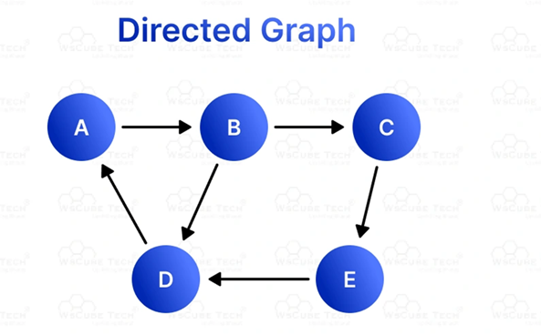

# Week 15: Graph Representations and Path Analysis

**CSC 326 - Data Structures**  
**Fall 2025**

## Lab Objectives

Master fundamental graph representations and path connectivity analysis:
1. Implement **Adjacency List** representation
2. Implement **Adjacency Matrix** representation  
3. Compute multi-step connectivity using **matrix multiplication**
4. Analyze k-length paths in directed graphs

---

## Graph Structure

### Directed Graph


**Vertices:** A, B, C, D, E  
**Edges (directed):**
- A → B
- B → C
- B → D
- C → E
- E → D
- D → A

**Key Property:** This graph contains a **cycle** (A → B → D → A)

---

## Vertex Indexing

For programming convenience, vertices map to array indices:

| Vertex | Index |
|--------|-------|
| A | 0 |
| B | 1 |
| C | 2 |
| D | 3 |
| E | 4 |

This mapping is used consistently across all three programs.

---

## Part 1: Adjacency List Representation

### Concept

An **adjacency list** stores the graph as an array of lists, where:
- `adjList[u]` contains all vertices `v` such that edge `u → v` exists

**Space Complexity:** O(V + E) where V = vertices, E = edges

### Implementation

**File:** `adjacencyList.cpp`

```cpp
vector<int> adjList[N];  // Array of vectors

// Add edge A → B (0 → 1)
adjList[0].push_back(1);
```

### Expected Output

```
Adjacency List Representation:
A: B 
B: C D 
C: E 
D: A 
E: D 
```

**Interpretation:**
- Vertex A has edges to: B
- Vertex B has edges to: C, D
- Vertex C has edges to: E
- Vertex D has edges to: A
- Vertex E has edges to: D

### Advantages of Adjacency Lists

✅ **Space-efficient** for sparse graphs  
✅ **Fast edge iteration** for a given vertex  
✅ **Easy to add edges** dynamically  

### Disadvantages

❌ **Slow edge lookup** - Must scan list to check if edge exists  
❌ **Harder to implement** certain algorithms (e.g., Floyd-Warshall)

---

## Part 2: Adjacency Matrix Representation

### Concept

An **adjacency matrix** is a 2D array where:
- `adjMat[u][v] = 1` if edge `u → v` exists
- `adjMat[u][v] = 0` otherwise

**Space Complexity:** O(V²) regardless of number of edges

### Implementation

**File:** `adjacencyMatrix.cpp`

```cpp
int adjMat[N][N];  // 5x5 matrix

// Initialize all to 0
for (int i = 0; i < N; ++i)
    for (int j = 0; j < N; ++j)
        adjMat[i][j] = 0;

// Add edge A → B (0 → 1)
adjMat[0][1] = 1;
```

### Expected Output

```
Adjacency Matrix:
   A B C D E 
A: 0 1 0 0 0 
B: 0 0 1 1 0 
C: 0 0 0 0 1 
D: 1 0 0 0 0 
E: 0 0 0 1 0 
```

**Reading the Matrix:**
- Row A, Column B = 1 → Edge A → B exists
- Row B, Columns C and D = 1 → Edges B → C and B → D exist
- Row E, Column D = 1 → Edge E → D exists

### Advantages of Adjacency Matrices

✅ **O(1) edge lookup** - Check `adjMat[u][v]` directly  
✅ **Simple to implement** matrix operations  
✅ **Good for dense graphs** (many edges)  
✅ **Enables mathematical analysis** (matrix powers)

### Disadvantages

❌ **Space-inefficient** for sparse graphs (O(V²) always)  
❌ **Slow to iterate** over all neighbors  
❌ **Adding/removing vertices** requires resizing entire matrix

---

## Part 3: Multi-Step Path Analysis

### Concept: Matrix Powers

**Key Mathematical Property:**

If M is the adjacency matrix of a graph:
- **M¹ = M** → 1-step paths (direct edges)
- **M² = M × M** → 2-step paths
- **M³ = M² × M** → 3-step paths
- **Mᵏ** → k-step paths

**Entry [i][j] in Mᵏ** = Number of k-length paths from vertex i to vertex j

### Implementation

**File:** `neighbors.cpp`

#### Matrix Multiplication

Standard algorithm for computing C = A × B:

```cpp
for (int i = 0; i < N; ++i) {
    for (int j = 0; j < N; ++j) {
        C[i][j] = 0;  // Initialize result cell
        for (int k = 0; k < N; ++k) {
            C[i][j] += A[i][k] * B[k][j];  // Sum products
        }
    }
}
```

**Time Complexity:** O(N³) for N×N matrices

#### Computing Powers

```cpp
// M² = M × M (2-step paths)
multiply(M, M, M2);

// M³ = M² × M (3-step paths)
multiply(M2, M, M3);
```

### Path Analysis for Vertex A

#### 2-Length Away Neighbors

Starting from A (index 0), check row 0 of M²:

**Paths of length 2 from A:**
- A → B → C ✓
- A → B → D ✓

**Output:**
```
2-length away neighbors of A: C D
```

**Interpretation:** You can reach C and D from A in exactly 2 steps.

#### 3-Length Away Neighbors

Starting from A (index 0), check row 0 of M³:

**Paths of length 3 from A:**
- A → B → C → E ✓
- A → B → D → A ✓ (cycle back to A!)

**Output:**
```
3-length away neighbors of A: A E
```

**Interpretation:** You can reach A (itself, via cycle) and E in exactly 3 steps.

---

## Graph Properties Analysis

### Paths from A

| Length | Reachable Vertices | Example Paths |
|--------|-------------------|---------------|
| 1 | B | A → B |
| 2 | C, D | A → B → C, A → B → D |
| 3 | A, E | A → B → D → A, A → B → C → E |

### Cycle Detection

The graph contains a **directed cycle:**
- **A → B → D → A**

Evidence: M³[0][0] > 0 (can reach A from A in 3 steps)

### Strongly Connected Components

This graph is **NOT strongly connected** because:
- Cannot reach B from D, E, or C
- Cannot reach C from D or E
- However, {A, B, D} forms a strongly connected subgraph (cycle)

---

## Compilation and Execution

### Compile All Programs

```bash
# Adjacency List
g++ -std=c++17 -o adjacencyList adjacencyList.cpp
./adjacencyList

# Adjacency Matrix
g++ -std=c++17 -o adjacencyMatrix adjacencyMatrix.cpp
./adjacencyMatrix

# Path Analysis
g++ -std=c++17 -o neighbors neighbors.cpp
./neighbors
```

### Expected Complete Output

**Program 1: adjacencyList.cpp**
```
Adjacency List Representation:
A: B 
B: C D 
C: E 
D: A 
E: D 
```

**Program 2: adjacencyMatrix.cpp**
```
Adjacency Matrix:
   A B C D E 
A: 0 1 0 0 0 
B: 0 0 1 1 0 
C: 0 0 0 0 1 
D: 1 0 0 0 0 
E: 0 0 0 1 0 
```

**Program 3: neighbors.cpp**
```
2-length away neighbors of A: C D 
3-length away neighbors of A: A E 
```

---

## Complexity Analysis

### Space Complexity

| Representation | Space | Best For |
|----------------|-------|----------|
| Adjacency List | O(V + E) | Sparse graphs (E << V²) |
| Adjacency Matrix | O(V²) | Dense graphs (E ≈ V²) |

**For this graph:**
- V = 5 vertices, E = 6 edges
- List: O(5 + 6) = 11 units
- Matrix: O(25) = 25 units
- **List is more efficient** (sparse graph)

### Time Complexity

| Operation | Adjacency List | Adjacency Matrix |
|-----------|----------------|------------------|
| Add edge | O(1) | O(1) |
| Check edge | O(degree(u)) | **O(1)** |
| Remove edge | O(degree(u)) | O(1) |
| Iterate neighbors | **O(degree(u))** | O(V) |
| Space | O(V + E) | O(V²) |

**Matrix multiplication:** O(V³) for each power

---

## Key Concepts Demonstrated

### 1. Graph Representation Trade-offs

**Adjacency List:**
- Better for sparse graphs
- Memory-efficient
- Fast neighbor iteration

**Adjacency Matrix:**
- Better for dense graphs
- Fast edge lookup
- Enables mathematical operations

### 2. Matrix Powers for Path Analysis

**Fundamental Property:**
```
M^k[i][j] = number of k-length paths from i to j
```

**Applications:**
- Shortest path algorithms
- Reachability analysis
- Graph diameter calculation
- Social network analysis (degrees of separation)

### 3. Directed vs Undirected Graphs

**This graph is directed:**
- Edge A → B does NOT imply B → A
- Matrix is NOT symmetric
- Must store edges explicitly in both directions for undirected

**For undirected graphs:**
- Store both directions: `adjList[u].push_back(v)` AND `adjList[v].push_back(u)`
- Matrix becomes symmetric: `adjMat[u][v] = adjMat[v][u]`

---

## Real-World Applications

### Social Networks
- **Adjacency List:** Store friendships (sparse)
- **M²:** Friends-of-friends recommendations
- **M³:** Degrees of separation analysis

### Web Graphs
- **Adjacency Matrix:** PageRank computation
- **Matrix Powers:** Link analysis
- **Connectivity:** Website navigation paths

### Transportation Networks
- **Adjacency List:** Road networks (sparse)
- **M²:** 2-hop routes
- **Shortest paths:** Dijkstra's algorithm

### Citation Networks
- **Directed Edges:** Paper A cites Paper B
- **Matrix Powers:** Indirect influence analysis
- **Reachability:** Research lineage tracking

---

## Advanced Topics (Not Implemented)

### Weighted Graphs
Instead of 1/0, store edge weights:
```cpp
adjMat[u][v] = weight;  // e.g., distance, cost
```

### Graph Traversal
- **BFS (Breadth-First Search):** Level-order exploration
- **DFS (Depth-First Search):** Recursive exploration

### Shortest Path Algorithms
- **Dijkstra's Algorithm:** Single-source shortest paths
- **Bellman-Ford:** Handles negative weights
- **Floyd-Warshall:** All-pairs shortest paths (uses matrix)

### Cycle Detection
- **DFS-based:** Track visited/in-stack vertices
- **Topological Sort:** Only possible for DAGs (no cycles)

---

## Verification Steps

### Test 1: Adjacency List
✓ A has 1 neighbor: B  
✓ B has 2 neighbors: C, D  
✓ C has 1 neighbor: E  
✓ D has 1 neighbor: A  
✓ E has 1 neighbor: D  

### Test 2: Adjacency Matrix
✓ Row A has 1 in column B only  
✓ Row B has 1s in columns C and D  
✓ Matrix has exactly 6 ones (6 edges)  
✓ Matrix is NOT symmetric (directed)  

### Test 3: Path Analysis
✓ From A in 2 steps: reach C (A→B→C), reach D (A→B→D)  
✓ From A in 3 steps: reach E (A→B→C→E), reach A (A→B→D→A)  
✓ Cycle detected: A appears in 3-length neighbors of A  

---

## Common Pitfalls

### ❌ Wrong Index Mapping
```cpp
// WRONG: Mixing up vertex labels and indices
adjList['A'].push_back('B');  // Characters, not indices!

// CORRECT: Use integer indices
adjList[0].push_back(1);  // A=0, B=1
```

### ❌ Undirected Edge Handling
```cpp
// WRONG for directed graph: Adding reverse edge
adjList[0].push_back(1);  // A → B
adjList[1].push_back(0);  // B → A (unintended!)

// CORRECT: Only add specified direction
adjList[0].push_back(1);  // A → B only
```

### ❌ Matrix Multiplication Order
```cpp
// WRONG: Computing M³ as M × M × M (inefficient)
multiply(M, M, temp);
multiply(temp, M, M3);  // Extra operation

// CORRECT: M³ = (M²) × M
multiply(M, M, M2);   // M² first
multiply(M2, M, M3);  // Then M³ = M² × M
```

### ❌ Forgetting Matrix Initialization
```cpp
// WRONG: Uninitialized matrix
int adjMat[N][N];
adjMat[0][1] = 1;  // Other cells have garbage values!

// CORRECT: Initialize to 0
for (int i = 0; i < N; ++i)
    for (int j = 0; j < N; ++j)
        adjMat[i][j] = 0;
```

---

## Key Takeaways

1. **Representation Choice Matters:**
   - Sparse graphs → Adjacency List (space-efficient)
   - Dense graphs → Adjacency Matrix (fast lookup)
   - Matrix operations → Must use Adjacency Matrix

2. **Matrix Powers Enable Path Analysis:**
   - M^k reveals all k-length paths
   - Useful for connectivity and reachability
   - Foundation for many graph algorithms

3. **Directed Graphs Have Direction:**
   - A → B does NOT imply B → A
   - Must track edge direction explicitly
   - Cycles can exist (A → B → ... → A)

4. **Time-Space Trade-offs:**
   - List: O(V + E) space, O(degree) edge check
   - Matrix: O(V²) space, O(1) edge check
   - Choose based on graph density and operations

---

## Files in This Lab

```
week15-graphs/
├── README.md              # This file
├── graph.png              # Visual reference
├── adjacencyList.cpp      # Task 1: Adjacency list implementation
├── adjacencyMatrix.cpp    # Task 2: Adjacency matrix implementation
└── neighbors.cpp          # Task 3: Matrix multiplication & path analysis
```

---

## Learning Outcomes

After completing this lab, you can:

✅ Implement both adjacency list and matrix representations  
✅ Choose appropriate representation based on graph properties  
✅ Perform matrix multiplication for path analysis  
✅ Compute multi-step reachability using matrix powers  
✅ Analyze directed graph structure and cycles  
✅ Understand space-time trade-offs in graph algorithms  

---

## Extension Challenges

1. **Modify for Undirected Graph:**
   - Add reverse edges automatically
   - Verify matrix symmetry

2. **Compute M⁴:**
   - Find 4-length away neighbors
   - Compare with M², M³ patterns

3. **Implement Edge Removal:**
   - Remove an edge from both representations
   - Verify consistency

4. **Count Total Paths:**
   - Sum all entries in M^k for total k-length paths
   - Analyze growth rate

5. **Weighted Graph Extension:**
   - Replace 1/0 with weights
   - Modify multiplication for shortest paths

---

**Lab Status:** ✅ Complete  
**Files:** 3 C++ programs + 1 graph image  
**Concepts:** Graph representations, matrix multiplication, path analysis  
**Complexity:** Adjacency List (O(V+E)), Matrix (O(V²)), Multiplication (O(V³))
